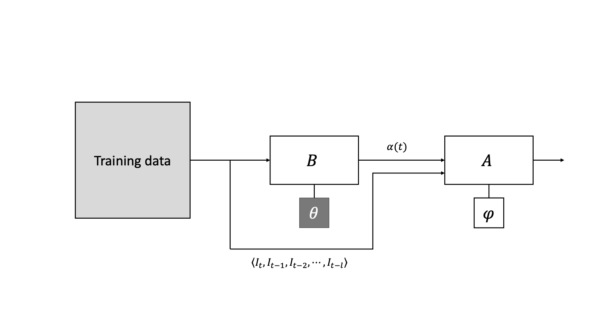

# Meta-Learning Methods for Video Matting

## Overview
This repository contains the implementation of a meta-learning approach for video matting, developed as part of my Master's Thesis at Ontario Tech University. The project explores novel methods like Boosting with Adapters (BwA) and Boosting using Ensemble (BuE) to address the complexities of video matting.

**Key Features:**
- Integration of meta-learning techniques to enhance alpha matte prediction.
- Efficient video matting using pre-trained segmentation models.
- Performance evaluation on the VideoMatte240K dataset with advanced metrics like MAD, MSE, GRAD, and CONN.

---

## Motivation and Background
Video matting is a challenging problem involving the separation of foreground objects from the background in video frames. Unlike static images, video matting must account for temporal dynamics, motion, and memory constraints.

This research extends image matting techniques to video by applying meta-learning, improving accuracy and efficiency in video-based alpha matte prediction.

---

## Methods

### Boosting with Adapters (BwA)

- Fine-tunes pre-trained segmentation models (adapters) to improve alpha matte prediction.
- Adapters correct errors iteratively, leveraging fixed backbone parameters for computational efficiency.

### Boosting using Ensemble (BuE)

- Combines multiple fine-tuned adapters using a Conv3D-based ensemble head.
- Improves overall matting quality by aggregating outputs from multiple adapters.

### Backbones and Adapters
- **Backbones:** FBAUNet++, VMFormer.
- **Adapters:** FPN, UNet, DeepLabV3, PAN, MANet, LinkNet.

---

## Dataset
This project uses the VideoMatte240K dataset:

- **Training Set:**
  - Initial Set: 1,000 frames from 5 videos.
  - Extended Set: 10,000 frames from 100 videos.
- **Test Set:**
  - 750 frames from 15 videos.


Preprocessing includes data cleaning, augmentation, and temporal alignment.

---

## Installation

Install the requirements:

```bash
  $ pip install -r requirements.txt
```

## Generating Data
In this step, you need to compose the dataset for this project, in order to do this we use 2 available datasets for the task of video matting. we use the foreground frames of different videos and also a shuffle background for each frame and we compose our own dataset. after creating the datatset, we pass our dataset to an image matting netwrok to get the base predictions.

#### please follow this steps:
1.

```bash
 $ mkdir matting
 $ cd matting
 $ git clone "remote URL"
 $ git clone "remote URL"
 $ mkdir data
```
2. Download the VideoMatte240K_JPEG_HD dataset from this [link](https://drive.google.com/file/d/1IUp_301x8BnPjE81QBzyLASn3ZSosUF6/view).
3. Download the Backgournd dataset from this [link](https://drive.google.com/file/d/1FqD-HfwXwbeTswQEIFaQkaVWUh_i6cSy/view). 
4. Extract the datasets you downloaded in 'data' folder.
5. Download the pretrained models you need from this [link](https://drive.google.com/file/d/1NzEjOtC9GqHnnLJoYfAx-l1_B-kEjYnX/view?usp=share_link). 
6. Extract the pretrained models that you downloaded in the matting folder.
7.
 ```bash
 $ python data_generation.py
```

## Training
after creating training, validation and testing dataset and putting them in 'train', 'val' and 'test' folders, you can run [dev.ipynb](https://github.com/negintabaraki/Thesis/blob/main/dev.ipynb) and train your model.


